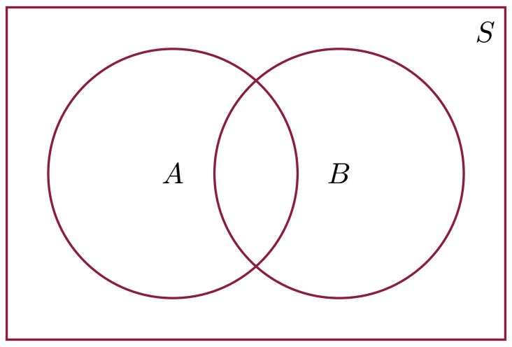
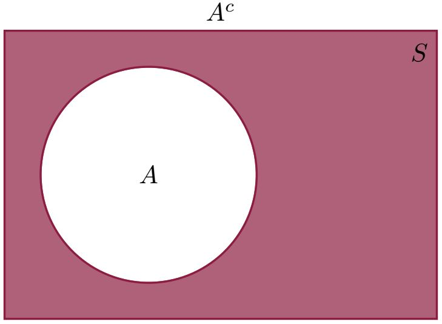
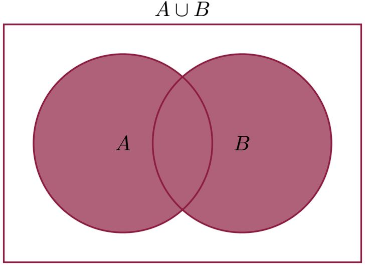
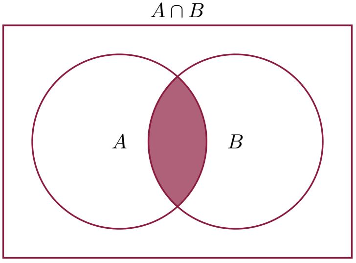
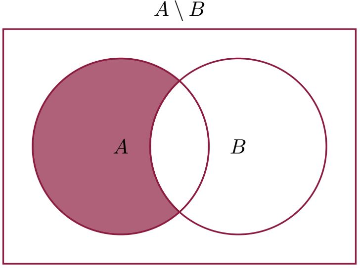

# 1.3 Set Operations; Venn Diagramms

One of the basic notion in Porbability theory is an event, which is seen as a set. Dealing with probability, let us first remind ourselves about set noation and basic properties of sets. We do that using Venn diagrams.

Suppose we are only interested in subsets of a certain, universal set $S$. Let $A , B \subseteq S$.

## Complement: $A^c$

$x \in A^c \iff x \notin A \ (\text{and } x \in S)$

## Union: $A \cup B$

$x \in A \cup B \iff x \in A \text{ or } x \in B$

## Intersection: $A \cap B$

$x \in A \cap B \iff x \in A \text{ and } x \in B$

## Difference: $A \setminus B$

$x \in A \setminus B \iff x \in A \text{ and } x \notin B$

More generally, suppose we have a family of sets $A_i$ indexed by $i \in I$ (where $I$ can be a finite or infinite set of indices, for example $I = \{1, 2, 3, \ldots, n\}$ or $I = \mathbb{N}$).

Then the **union** $\bigcup_{i \in I} A_i$ is defined as the set of all elements that belong to at least one of the sets $A_i$.

$$
x \in \bigcup_{i \in I}A_i \iff x \in A_{i_0} \text{ for at least one index } i_0 \in I\\
\quad \iff (\exists i_0 \in I) \ x \in A_{i_0}
$$