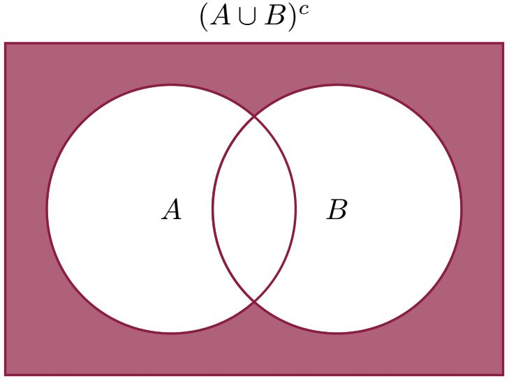
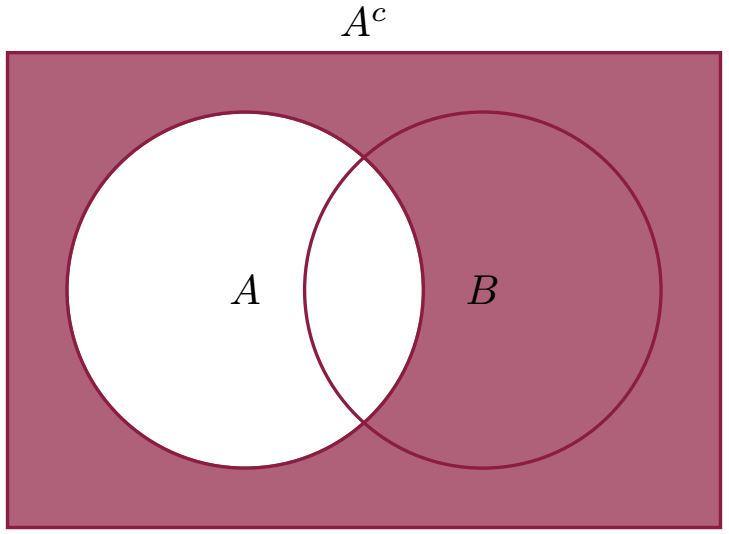
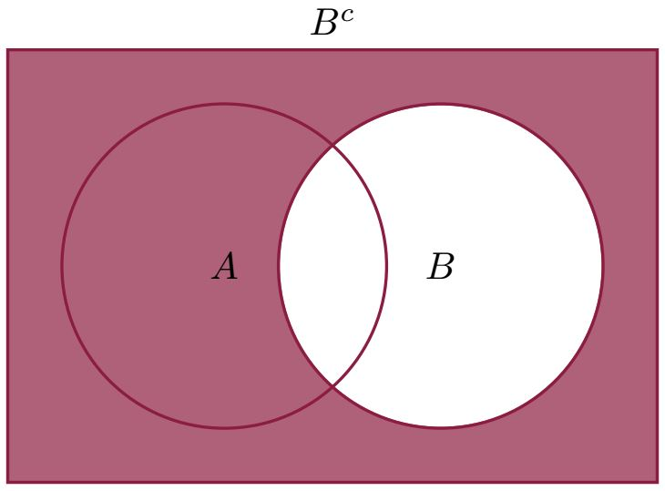
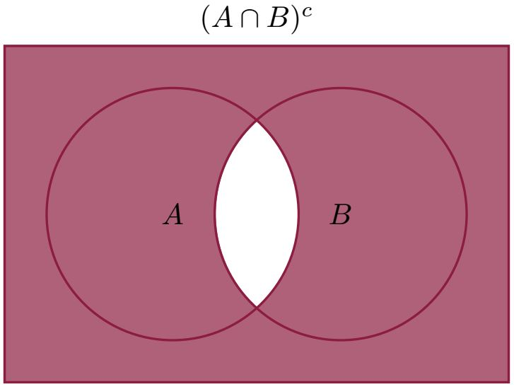

# 1.4 De Morgan's Laws

De Morgan's laws are mathematical formulation of certain rules in common sense reasoning (logic). We state them in set notation and simply justify them by Venn diagrams.

- $(A \cup B)^c = A^c \cap B^c$
- $(A \cap B)^c = A^c \cup B^c$

Generalization:

- $\left(\bigcup_{i \in I} A_i\right)^c=\bigcap_{i \in I} A_i^c$
- $\left(\bigcap_{i\in I}A_i\right)^c=\bigcup_{i \in I}A_i^c$
- $\left(A \cup B\right)^c = A^c \cap B^c$

- $\left( A \cap B \right)^c = A^c \cup B^c$

Here is a simple illustration of this second De Morgan's law.

**Example**

Denote by $A$ an event that a groom says "yes", and $B$ is an event that the bride says "yes". In order for marriage to be concluded, they both have to say "yes", that is, the event $A \cap B$ has to happen. The marriage will no be concluded, i.e. $(A \cap B)^c$ will happen, if an only if at least one of them says "no", that is, if an only if $A^c$ or $B^c$ happens.

De Morgan's laws are true for arbitrary collection of sets $A_i$, $i \in I$ (here, $I$ is an index set).

- $\left(\bigcup_{i \in I} A_i\right)^c=\bigcap_{i \in I} A_i^c$
- $\left(\bigcap_{i\in I}A_i\right)^c=\bigcup_{i \in I}A_i^c$